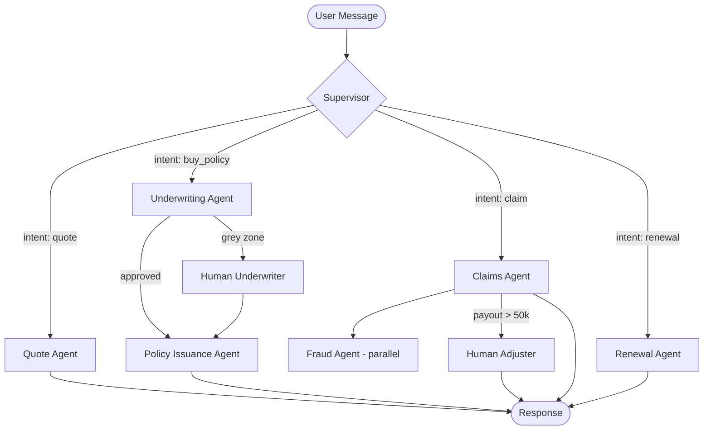

# LangGraph Flow Diagram

Mermaid source for the supervisor + sub-agent graph.

```mermaid
graph TD
    Start([User Message]) --> Supervisor{Supervisor}
    Supervisor -->|intent: quote| Quote[Quote Agent]
    Supervisor -->|intent: buy_policy| Underwriting[Underwriting Agent]
    Underwriting -->|approved| Policy[Policy Issuance Agent]
    Underwriting -->|grey zone| HITL1[Human Underwriter]
    Supervisor -->|intent: claim| Claims[Claims Agent]
    Claims --> Fraud[Fraud Agent - parallel]
    Claims -->|payout > 50k| HITL2[Human Adjuster]
    Supervisor -->|intent: renewal| Renewal[Renewal Agent]
    Quote --> End([Response])
    Policy --> End
    Claims --> End
    Renewal --> End
    HITL1 --> Policy
    HITL2 --> End
```
